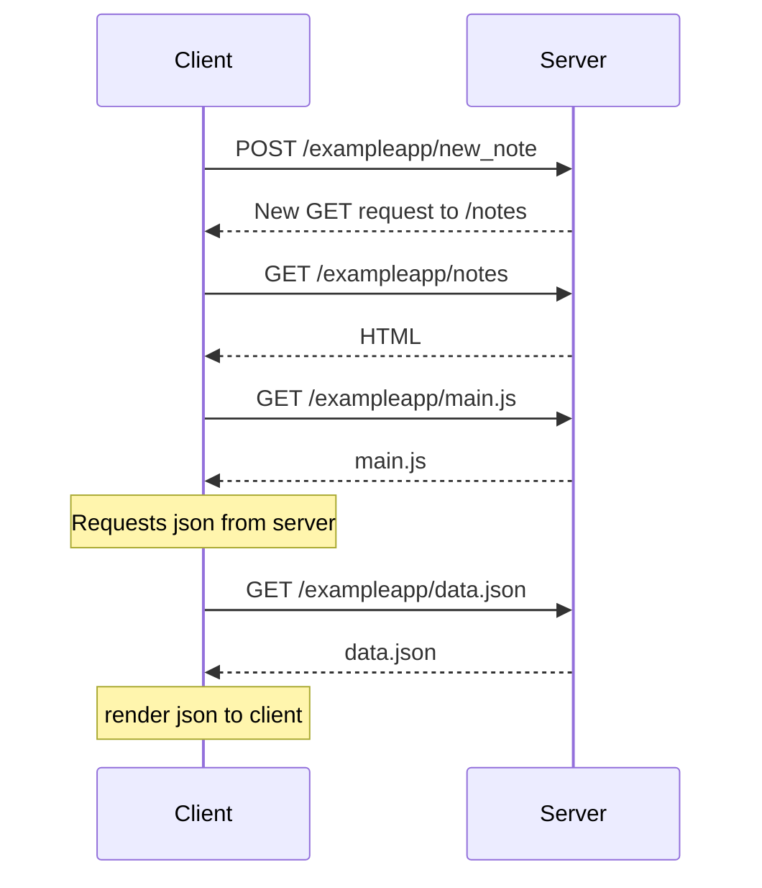

```mermaid
    sequenceDiagram
    Client ->>Server: POST /exampleapp/new_note
    Server -->>Client: New GET request to /notes
    Client ->>Server: GET /exampleapp/notes
    Server -->>Client: HTML
    Client ->>Server: GET /exampleapp/main.js
    Server -->>Client: main.js
    Note over Client: Requests json from server
    Client ->>Server: GET /exampleapp/data.json
    Server -->>Client: data.json
    Note over Client: render json to client

```